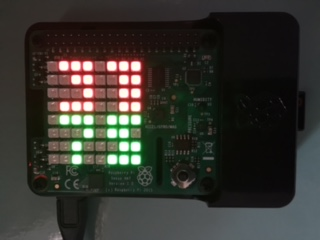

# Raspberry Pi + Sense Hat Thermometer
A collection temperature and humidity examples, based on Sense Hat supplied sample code.

## thermometer.py
Displays temperature and relative humidity at once on the Sense Hat 8x8 LED display
- 2 digit temperature
- 2 digit relative humidity

## thermo-bars.py
Displays a 2 column bar chart of temperature and relative humidity.

## thermo-scroll.py
Displays scrolling text of temperature and relative humidity

## sensor adjustments for temperature and humidity
Based on the [discussion thread](https://www.raspberrypi.org/forums/viewtopic.php?f=104&t=111457)
the temperature settings for the digital thermometer (thermometer.py) have been adjusted to display
ambient values.

Note that the callibration has not been validated beyond 28C to 32C.

## small numbers pixel maps
Collection of 4x4 pixel digits used for displaying 2 digits on 2 lines of the 8x8 Sense Hat display
- small_nums.thin.py displays a set of 3x4 pixel digits, giving a leading empy line between digits
- small_nums.think.py displays a set of 4x4 pixel digits, leaving no spaces between digits
